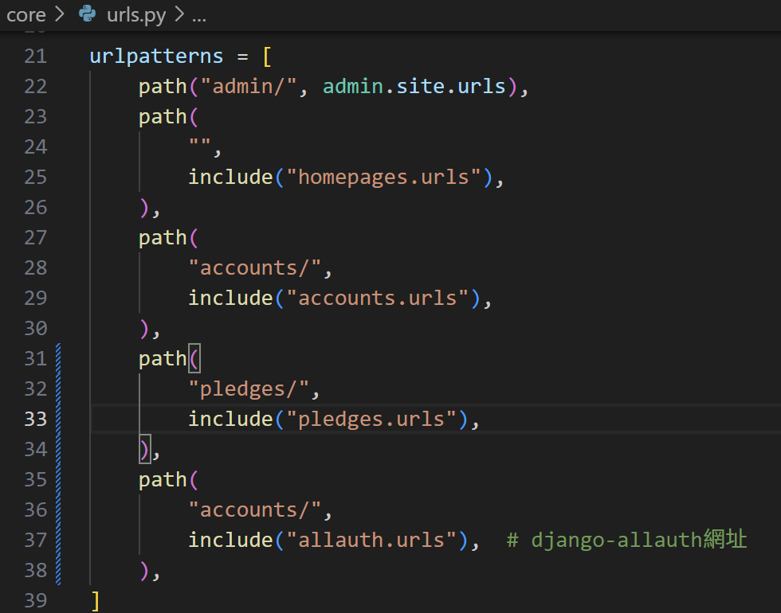
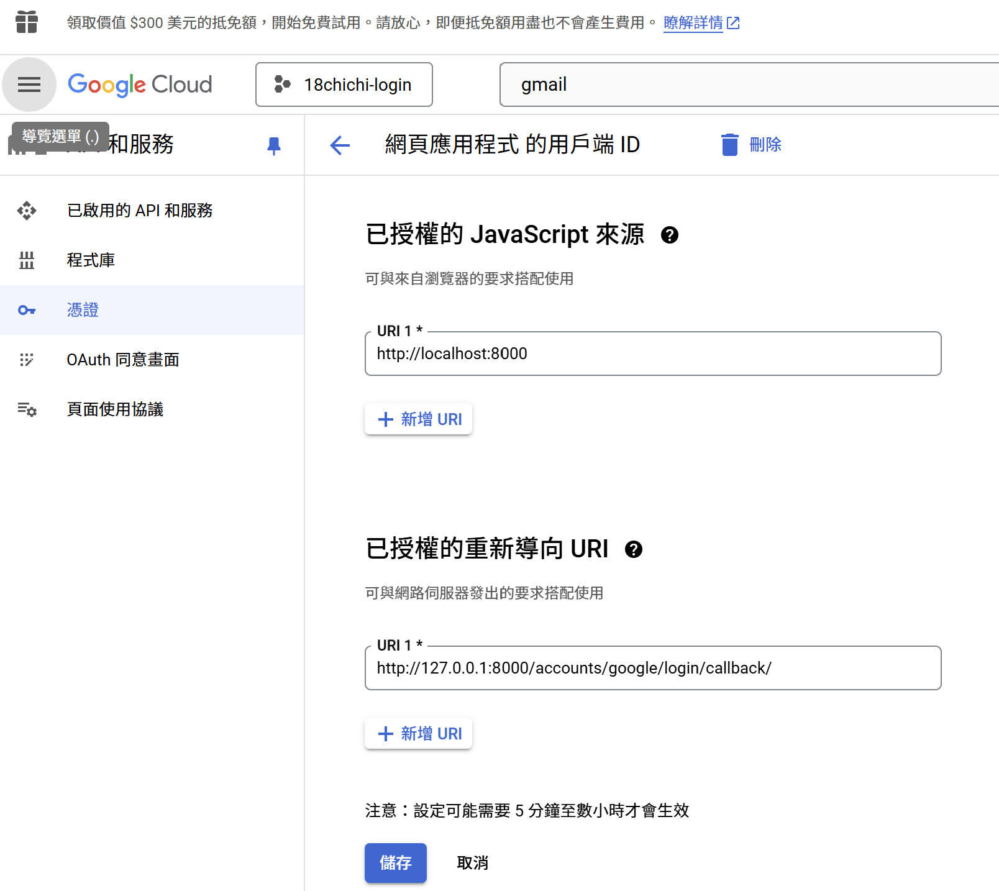
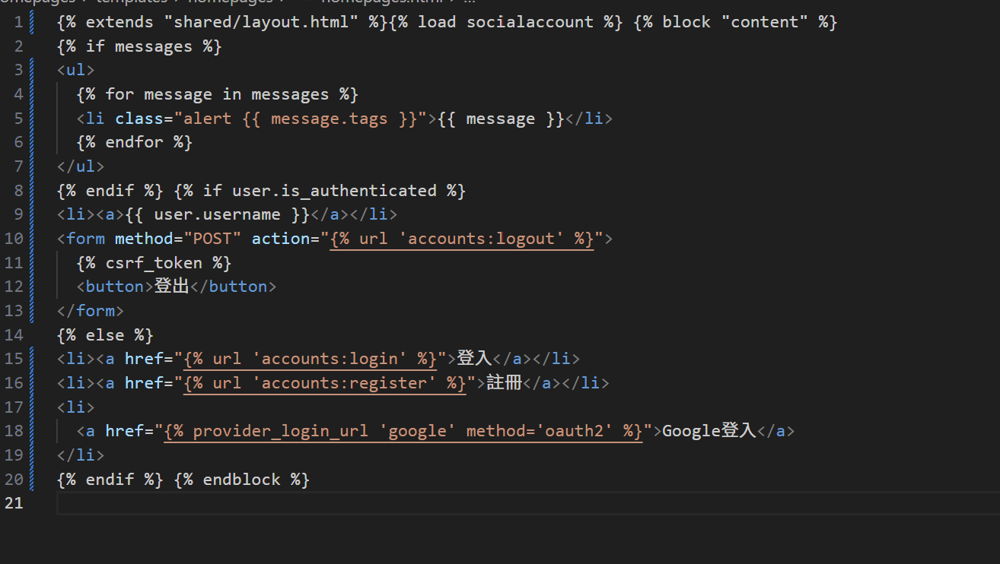

+++
date = '2024-12-14'
draft = false
title = 'django串接google第三方登入'
show_reading_time=true
featured_image = 'images/ribbon candle.jpg'
+++

詳細的參考文件(Document)可以前往 Django Package 官網
[django-allauth](https://docs.allauth.org/en/dev/socialaccount/providers/google.html)

首先先安裝套件

```terminal
pip install django-allauth
```

<!--more-->

安裝完成後，開啟 Django 專案的 settings.py，在 INSTALL_APPS 中，加入 allauth 套件及所需的第三方登入驗證提供者(provider)，其中的 SITE_ID 為網站 ID，自行定義即可。
如下範例：

```py
INSTALLED_APPS = [
    "django.contrib.admin",
    "django.contrib.auth",
    "django.contrib.contenttypes",
    "django.contrib.sessions",
    "django.contrib.messages",
    "django.contrib.staticfiles",
    "django.contrib.sites",

    #allauth
    "allauth",
    "allauth.account",
    "allauth.socialaccount",
    # google provider
    "allauth.socialaccount.providers.google",
]
```

```py
#settings.py

SITE_ID = 1

```

```py
#settings.py
MIDDLEWARE = [
    "django.middleware.security.SecurityMiddleware",
    "django.contrib.sessions.middleware.SessionMiddleware",
    "django.middleware.common.CommonMiddleware",
    "django.middleware.csrf.CsrfViewMiddleware",
    "django.contrib.auth.middleware.AuthenticationMiddleware",
    "django.contrib.messages.middleware.MessageMiddleware",
    "django.middleware.clickjacking.XFrameOptionsMiddleware",
    "allauth.account.middleware.AccountMiddleware",  # allauth
    #多站點應用、單站點應用、測試跳轉功能

]
```

```py
SOCIALACCOUNT_PROVIDERS = {
    "google": {
        "APPS": [
            {
                "client_id": env("GMAIL_CLIENT_ID"),  #api獲得的cliend_id使用env保管
                "secret": env("GMAIL_API_SECRET"), #api獲得的secret使用env保管
                "settings": {
                    "scope": [   #請求的權限範圍
                        "profile",
                        "email",
                    ],
                    "auth_params": {
                        "access_type": "online",  #指定使用在線授權模式，不涉及離線（即不需要刷新令牌）。
                    },
                    "redirect_uri": "http://127.0.0.1:8000/accounts/google/login/callback/",  #當 Google 完成驗證後，重定向回應用的 URL。

                },
            },
        ],
    }
}

```

```py
#settings.py
AUTHENTICATION_BACKENDS = (
    "django.contrib.auth.backends.ModelBackend",
    "allauth.account.auth_backends.AuthenticationBackend",
)
```

`AUTHENTICATION_BACKENDS` 是用來配置驗證後端的設置，定義了 Django 如何處理用戶的身份驗證請求。

- `ModelBackend` 是 Django 的默認驗證後端，負責處理基於用戶模型（User 模型）的基本身份驗證邏輯。

- `allauth.account.auth_backends.AuthenticationBackend` 提供的驗證後端，用於處理社交帳號登錄（例如 Google、Facebook 等第三方登錄）和基於電子郵件的
  驗證邏輯。

  1.社交帳號支持  
  2.電子郵件認證  
  3.自動創建用戶(當使用社交帳號登錄且用戶不存在時，allauth 會自動創建一個新的用戶。)

```py
#settings.py

# Allauth 設置
SOCIALACCOUNT_LOGIN_ON_GET = True  #用戶完成社交帳號認證後，直接登錄，省略確認頁面。
ACCOUNT_EMAIL_REQUIRED = True  #註冊時必須提供電子郵件。
ACCOUNT_UNIQUE_EMAIL = True  #每個電子郵件地址必須唯一。
ACCOUNT_AUTHENTICATION_METHOD = "email"  #用戶只能通過電子郵件登錄，禁用用戶名登錄。
```

```py
LOGIN_REDIRECT_URL = "/"  # 登入後的首頁網址
```

urls.py 新增 path


#### Google api

首先到 google cloud  
建立專案

搜尋 gmail-->啟用 -->建立憑證
之後開始填寫憑證資訊

把憑證 Oauth Client IDS 裡面的資料，把這些資料放 `settings.py`的 SOCIALACCOUNT_PROVIDERS 的 client_ID、secret 欄位，要記得在.env 加密保管

詳細步驟請看影片
[](https://youtu.be/LyDdfO6o_G4?si=y9YVgIeLSSSvmHab)

要注意的是，重新導向 url


接著，回到 Django Administration(管理員後台)首頁，選擇「Sites」資料模型，將 example.com 修改為自己的網站，由於本文以本地端伺服器來執行，所以修改的內容如下：


Client id、Secret key 都可以在 google cloud 剛剛輸入的憑證得到。

回到 templates 樣板 修改

